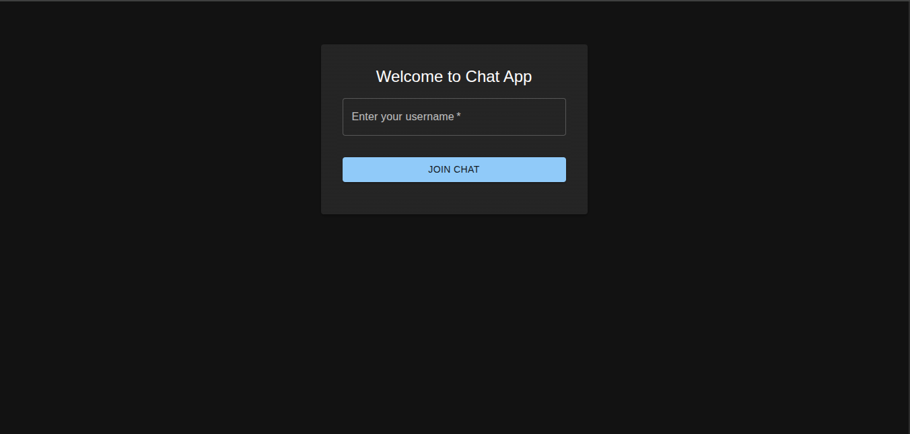
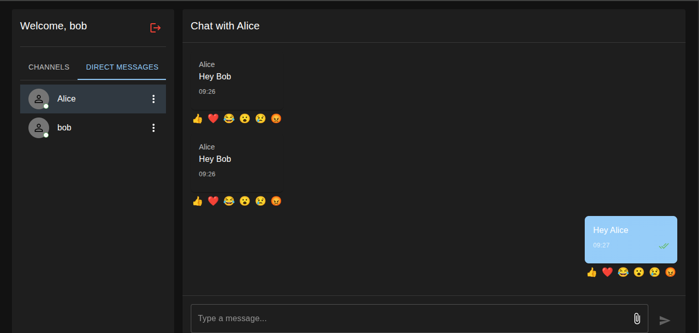

# Real-Time Chat Application with Socket.io

A modern, feature-rich real-time chat application built with **React**, **Express**, and **Socket.io**. This project demonstrates real-time bidirectional communication, user management, typing indicators, message reactions, read receipts, and multi-channel support.

## 📋 Table of Contents

- [Project Overview](#project-overview)
- [Features Implemented](#features-implemented)
- [Tech Stack](#tech-stack)
- [Setup Instructions](#setup-instructions)
- [Project Structure](#project-structure)
- [Usage](#usage)
- [Screenshots](#screenshots)
- [Advanced Features](#advanced-features)
- [Troubleshooting](#troubleshooting)

---

##  Project Overview

This real-time chat application enables users to:
- **Login with a username** (no password required for simplicity)
- **Send and receive messages** instantly across the global chat room
- **Start private one-on-one conversations** with other users
- **Join multiple chat channels** (General, Random, etc.)
- **See who's online** with real-time status updates
- **Type notifications** to see when others are typing
- **React to messages** with emojis (👍, ❤️, 😂, etc.)
- **Read receipts** to confirm message delivery
- **Persistent user sessions** with localStorage

The application uses **Socket.io** for real-time bidirectional communication between clients and the server, ensuring instantaneous message delivery and live updates.

---

##  Features Implemented

### Core Features
-  **Real-time Messaging**: Instant message delivery and display
-  **User Authentication**: Simple username-based login (no password)
-  **Online Status**: See who's currently online with visual indicators
-  **User Join/Leave Notifications**: System messages when users connect or disconnect
-  **Global Chat Room**: Broadcast messages to all connected users

### Socket.io Features
-  **Typing Indicators**: See when other users are typing
-  **Private Chats**: One-on-one messaging between users
-  **Message Reactions**: React to messages with emoji reactions (👍 ❤️ 😂)
-  **Read Receipts**: Single/double checkmarks show message delivery and read status
-  **Message History**: Load previous messages when joining a room
-  **Room Management**: Private rooms and channels for organized conversations

### UI/UX Features
-  **Multi-channel Support**: Switch between different chat channels (General, Random)
-  **Sidebar User List**: View all online users with real-time updates
-  **Unread Message Badges**: Badges show unread message counts
-  **Dark Theme**: Material-UI dark theme for comfortable viewing
-  **Responsive Design**: Works on desktop and tablet screens
-  **Message Filtering**: Automatically filters messages per room/private chat

### Advanced Features
-  **Persistent Sessions**: Username saved to localStorage
-  **Notification Sounds**: Web Audio API tone on new messages
-  **Offline User Filtering**: Only shows online users in the sidebar
-  **Duplicate User Prevention**: Same username can only have one active session
-  **System Messages**: Join/leave notifications displayed in chat

---

##  Tech Stack

### Frontend
- **React 18** - UI library
- **React Router v6** - Client-side routing
- **Material-UI (MUI)** - Component library and theming
- **Socket.io Client** - Real-time communication
- **Vite** - Build tool and dev server
- **date-fns** - Date formatting utilities

### Backend
- **Node.js** - JavaScript runtime
- **Express.js** - Web server framework
- **Socket.io** - Real-time communication library
- **CORS** - Cross-origin resource sharing

### Development Tools
- **Git** - Version control
- **npm** - Package manager

---

##  Setup Instructions

### Prerequisites
- Node.js (v16 or higher)
- npm or yarn package manager
- Git

### Backend Setup

1. **Navigate to the server directory:**
   ```bash
   cd server
   ```

2. **Install dependencies:**
   ```bash
   npm install
   ```

3. **Create a `.env` file** (optional, for configuration):
   ```bash
   touch .env
   ```
   
   Add the following environment variables:
   ```env
   PORT=5000
   CLIENT_URL=http://localhost:5173
   NODE_ENV=development
   ```

4. **Start the backend server:**
   ```bash
   npm start
   ```
   
   Or for development with auto-reload (if nodemon is installed):
   ```bash
   npm run dev
   ```
   
   The server will run on `http://localhost:5000`

### Frontend Setup

1. **Navigate to the client directory:**
   ```bash
   cd client
   ```

2. **Install dependencies:**
   ```bash
   npm install
   ```

3. **Create a `.env.local` file** (optional, for configuration):
   ```bash
   touch .env.local
   ```
   
   Add the following environment variables:
   ```env
   VITE_SERVER_URL=http://localhost:5000
   ```

4. **Start the development server:**
   ```bash
   npm run dev
   ```
   
   The frontend will run on `http://localhost:5173`

### Running Both Servers (Recommended)

Open two terminal windows and run:

**Terminal 1 (Backend):**
```bash
cd server
npm install
npm start
```

**Terminal 2 (Frontend):**
```bash
cd client
npm install
npm run dev
```

Then open your browser to `http://localhost:5173`

---

## 📁 Project Structure

```
real-time-communication-with-socket-io-StephenNafula/
├── server/
│   ├── server.js                 # Main Express/Socket.io server
│   ├── package.json
│   ├── public/                   # Static assets (optional)
│   └── .env                      # Environment variables
│
├── client/
│   ├── src/
│   │   ├── components/
│   │   │   ├── ChatRoom.jsx      # Main chat room component
│   │   │   ├── ChatSidebar.jsx   # Sidebar with users/channels
│   │   │   ├── MessageList.jsx   # Message display component
│   │   │   ├── MessageInput.jsx  # Message input field
│   │   │   ├── Login.jsx         # Login page
│   │   │   └── PrivateRoute.jsx  # Route protection
│   │   ├── context/
│   │   │   ├── SocketContext.jsx # Socket.io context provider
│   │   │   └── AuthContext.jsx   # Authentication context
│   │   ├── socket/
│   │   │   └── socket.js         # Socket configuration (legacy)
│   │   ├── App.jsx               # Root component
│   │   ├── main.jsx              # Entry point
│   │   └── index.css             # Global styles
│   ├── public/
│   │   ├── screenshots/          # App screenshots
│   │   │   ├── login.png
│   │   │   └── chat-view.png
│   │   └── index.html
│   ├── package.json
│   ├── .env.local                # Environment variables
│   └── vite.config.js            # Vite configuration
│
├── .gitignore
└── README.md
```

---

##  Usage

### Logging In

1. Open the application in your browser (`http://localhost:5173`)
2. Enter a **username** (no password needed)
3. Click **"Join Chat"** button
4. You'll be added to the chat room and see a "User joined" notification

### Sending Messages

1. **Global Chat**: Type a message in the input field and press Enter or click Send
2. **Private Chat**: 
   - Click on a user in the "Direct Messages" tab
   - Type and send messages (only visible to that user)
3. **Channel Chat**: 
   - Click on a channel in the "Channels" tab
   - Type and send messages in that channel

### Interacting with Messages

- **React**: Hover over a message and click an emoji reaction button
- **Read Receipts**: Check marks show message delivery status
- **Delete Session**: Click the logout button (power icon) to disconnect

### Viewing User Status

- **Green Online Indicator**: User is currently online
- **User Badge**: Shows unread message count from that user
- **Typing Indicator**: "User is typing..." appears at the top of chat

---

##  Screenshots

### Login Page


The login page allows users to enter a username and join the chat application instantly.

### Chat View


The main chat interface showing:
- **Left Sidebar**: Online users list and available channels with unread badges
- **Main Chat Area**: Messages with sender name, timestamp, and delivery status
- **Top Header**: Current chat room title and typing indicators
- **Bottom Input**: Message input field with file attachment and send buttons

---

##  Advanced Features

### Message Reactions
Users can add emoji reactions to messages (👍 ❤️ 😂 😮 😢 😡). Reactions appear below messages and show who reacted with what emoji.

### Read Receipts
- **Single Check (✓)**: Message delivered to server
- **Double Check (✓✓)**: Message read by recipient
- Only visible on your own sent messages

### Typing Indicators
When another user starts typing, a notification appears at the top showing:
```
Username typing...
```

### Channel Management
Pre-configured channels:
- **#general** - Main discussion channel
- **#random** - Off-topic conversations

Users can switch between channels using the sidebar tabs and see channel-specific message history.

### Private Rooms
Each private conversation is stored in a unique room (based on sorted socket IDs). Message history persists for the session.

### Offline User Handling
- Offline users are hidden from the Direct Messages list
- System message appears when user disconnects
- Same username can only have one active session (old connection is replaced)

---

##  Troubleshooting

### Issue: "Connection refused" error
**Solution**: 
- Ensure the backend server is running on port 5000
- Check that `VITE_SERVER_URL` in `.env.local` points to the correct server URL
- Verify no firewall is blocking port 5000

### Issue: "Chatting with undefined" 
**Solution**: 
- This should be fixed in the latest version. If it persists:
  - Clear browser cache
  - Restart both servers
  - Check browser console for errors

### Issue: Messages not appearing
**Solution**:
- Check browser console for JavaScript errors
- Verify Socket.io connection in DevTools (Network tab)
- Ensure you're in the correct room/private chat
- Restart the backend server

### Issue: Offline users still showing
**Solution**:
- Refresh the page
- The sidebar filters should automatically hide offline users
- Verify server is removing users on disconnect

### Issue: Duplicate users with same username
**Solution**:
- This is fixed in the latest version
- The server now removes old connections if the same username reconnects
- Refresh the page if duplicates appear

### Issue: Git warning about `.git/gc.log`
**Solution**:
```bash
cd /path/to/repo
rm -f .git/gc.log
git prune
git gc --aggressive
```

---

##  Environment Variables

### Backend (.env)
```env
PORT=5000                              # Server port
CLIENT_URL=http://localhost:5173      # Frontend URL (for CORS)
NODE_ENV=development                  # Environment
```

### Frontend (.env.local)
```env
VITE_SERVER_URL=http://localhost:5000 # Backend server URL
```

---

##  Security Notes

This is a **demonstration/educational application**. For production use, consider:

-  Add proper authentication (JWT, OAuth)
-  Implement password hashing
-  Add rate limiting and input validation
-  Use a persistent database (MongoDB, PostgreSQL)
-  Enable HTTPS/WSS for encryption
-  Implement user permissions and roles
-  Add message encryption
-  Implement proper session management

---

##  Learning Resources

- [Socket.io Documentation](https://socket.io/docs/)
- [React Documentation](https://react.dev/)
- [Express.js Guide](https://expressjs.com/)
- [Material-UI Docs](https://mui.com/)
- [Vite Guide](https://vitejs.dev/)

---

##  License

This project is open-source and available for educational purposes.

---

##  Contributing

Contributions are welcome! Feel free to:
- Report bugs
- Suggest new features
- Submit pull requests
- Improve documentation

---

##  Support

For issues, questions, or suggestions:
1. Check the [Troubleshooting](#troubleshooting) section
2. Review browser console for error messages
3. Check Socket.io connection status in DevTools
4. Review server logs for backend errors

---

##  Congratulations!

You now have a fully functional real-time chat application. Start chatting with friends, test the features, and enjoy real-time communication!

**Happy Chatting!**  